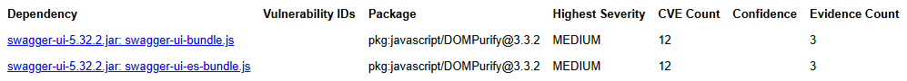

# Sécurité — DataShare

1. [Scan de sécurité](#1-scan-de-sécurité)
2. [Vulnérabilités corrigées](#2-vulnérabilités-corrigées)
3. [Vulnérabilités acceptées](#3-vulnérabilités-acceptées)
4. [Vulnérabilités ignorées (faux positifs)](#4-vulnérabilités-ignorées-faux-positifs)

## 1. Scan de sécurité

Deux outils, un par écosystème :

| Écosystème | Outil | Commande |
|---|---|---|
| Backend (Java/Gradle) | [OWASP Dependency-Check](https://owasp.org/www-project-dependency-check/) | `./gradlew dependencyCheckAnalyze` |
| Frontend (npm) | `npm audit` (natif) | `npm audit` (dans `frontend/` et `e2e/`) |

Rapport HTML généré dans `backend/build/reports/dependency-check-report.html` (non committé, généré à chaque run).

**Résultat backend (dernier scan, 2026-07-15)** :

Cette capture est prise **après** application des correctifs de la section 2 et des suppressions de la section 4 — ne restent que les entrées acceptées (section 3).

**Résultat frontend (`npm audit`)** :

| Projet | Vulnérabilités | Détail |
|---|---|---|
| `frontend/` | 3 low | `@babel/core` et `esbuild`, tous deux utilisés en interne par la chaîne de build `@angular/build` — jamais dans le bundle de production livré (`ng build` n'embarque que `dependencies`, pas `devDependencies`) |
| `e2e/` | 0 | — |

## 2. Vulnérabilités corrigées

Ces bibliothèques ne sont pas déclarées directement dans le projet — elles arrivent avec Spring Boot ou le SDK AWS, qui imposent normalement leur propre version. On ne réfléchit pas plus loin : on force juste la version corrigée (bloc `constraints { }` dans `backend/build.gradle`), sans autre changement de code :

| Dépendance | CVE | Sévérité | Problème | Version cible |
|---|---|---|---|---|
| `jackson-databind` | CVE-2026-54515 | MEDIUM (5.3) | une exclusion `@JsonIgnoreProperties` pouvait être réactivée par erreur en présence de `@JsonFormat(ACCEPT_CASE_INSENSITIVE_PROPERTIES)`, rendant une propriété normalement ignorée de nouveau modifiable | 2.21.4 → 2.21.5 |
| `log4j-api` / `log4j-to-slf4j` | CVE-2026-49844 | MEDIUM (5.9-6.3) | une valeur flottante non-finie (NaN/Infinity) dans un `MapMessage` produit un JSON de log invalide (RFC 8259), pouvant perturber l'ingestion des logs | 2.25.4 → 2.25.5 |
| `postgresql` (driver JDBC) | CVE-2026-54291 | MEDIUM/HIGH | `channelBinding=require` pouvait être silencieusement rétrogradé en SCRAM sans channel binding face à un certificat TLS spécifique, perdant la protection anti-MITM associée | 42.7.11 → 42.7.13 |
| `tomcat-embed-core` / `tomcat-embed-websocket` | 8 CVE (dont 4 CRITICAL 9.1) | CRITICAL/HIGH/MEDIUM | plusieurs défauts Tomcat 11.0.x (voir détail ci-dessous) | 11.0.22 → 11.0.24 |
| `httpcore5-h2` (transitif via le SDK AWS S3) | CVE-2026-54399, CVE-2026-54428 | HIGH (7.5) | déni de service par épuisement mémoire, sur le parsing d'en-têtes HTTP/1.1 et le décodeur HPACK HTTP/2 | 5.4.2 → 5.4.3 |

**Détail Tomcat** : la version embarquée par Spring Boot 4.1.0 (11.0.22) est bien dans la plage vulnérable des 8 CVE recensées, mais la majorité concerne des fonctionnalités non utilisées par ce projet (connecteur FFM, `EncryptionInterceptor` de clustering, `rewrite valve`, webapp d'exemple "number guess" — non embarquée par Spring Boot). Correctif appliqué quand même : le bump de version est gratuit et referme la surface d'attaque théorique.

Vérification post-correctif : suite backend complète relancée (`./gradlew test`), puis nouveau scan `dependencyCheckAnalyze` confirmant la disparition de ces entrées.

## 3. Vulnérabilités acceptées

| Dépendance | CVE | Sévérité | Raison de l'acceptation |
|---|---|---|---|
| `swagger-ui` (webjar de `springdoc-openapi`), JS embarqué `DOMPurify@3.3.2` | 6 CVE (contournements de sanitisation XSS) | MEDIUM (~6.0) | Pas de correctif disponible : `springdoc-openapi-starter-webmvc-ui` est déjà à sa dernière version publiée (3.0.3), qui embarque cette version de `swagger-ui`/`DOMPurify`. Exposition limitée : `/swagger-ui/**` est une page de documentation technique interne (accès public par nature, comme toute doc Swagger), pas un vecteur qui manipule les données utilisateur de l'application. |
| `frontend` (`@babel/core`, `esbuild`, via `@angular/build`) | 3 CVE low | LOW | Dépendances de la chaîne de build/dev uniquement (`devDependencies`), jamais présentes dans le bundle de production livré. Déjà sur la dernière version stable d'Angular (22.0.6) — aucune version 22.x corrigée n'existe encore à ce jour, le correctif n'existe que sur la ligne 21 (antérieure). |

## 4. Vulnérabilités ignorées (faux positifs)

Faux positifs confirmés (mauvais rapprochement entre le nom de la dépendance et un produit tiers sans rapport), déclarés dans `backend/dependency-check-suppressions.xml` (matching par SHA1 exact du binaire, pas juste par nom) pour ne plus polluer les scans futurs :

| Dépendance | CVE | Raison |
|---|---|---|
| `pitest-command-line` (dépendance de test, mutation testing) | CVE-2015-0897 | Concerne en réalité l'application mobile "LINE" (Android/iOS) — matché uniquement parce que le mot "line" apparaît dans "command-line". Aucun rapport avec PIT/pitest. Dépendance de test au demeurant, jamais livrée dans l'application. |
| `spring-boot-devtools` | CVE-2022-31691 | Concerne en réalité "Spring Tools 4 for Eclipse" et des extensions VSCode (Spring Boot Tools, Concourse CI Pipeline Editor...) — matché par simple similarité de nom. Dépendance en scope Gradle `developmentOnly`, jamais présente dans le jar packagé de toute façon. |
