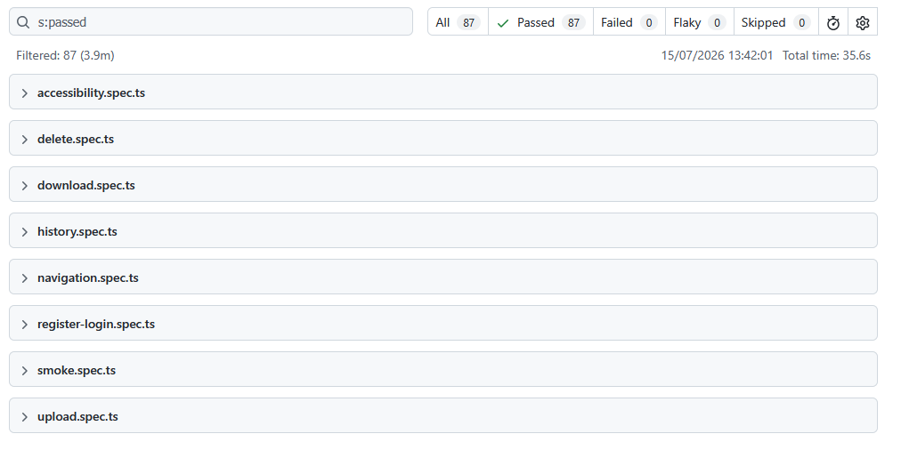
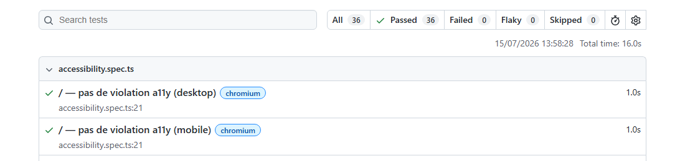
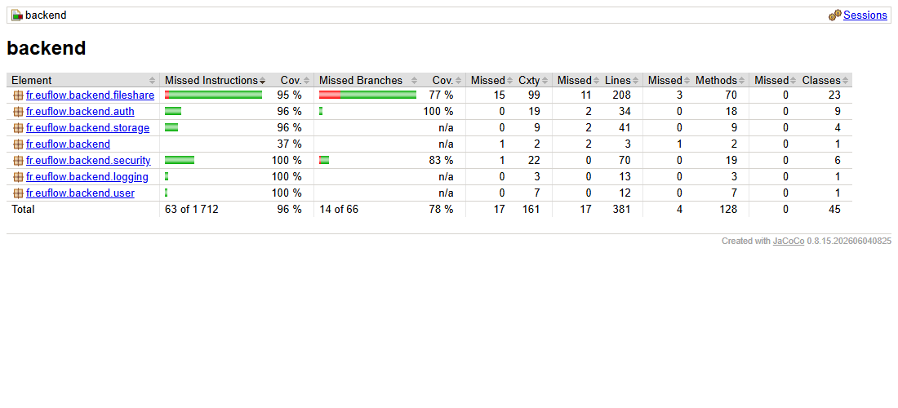

# Plan de tests — DataShare

Structuré directement autour des 3 exigences de l'étape 5 de la mission :
1. [Plan de tests documenté et résultats exploitables](#1-plan-de-tests-documenté-et-résultats-exploitables)
2. [Tests exécutables (unitaires, intégration, e2e) sur les fonctionnalités critiques](#2-tests-exécutables-unitaires-intégration-et-end-to-end-sur-les-fonctionnalités-critiques)
3. [Rapport de couverture de code ≥ 70 %](#3-rapport-de-couverture-de-code-≥-70)

## 1. Plan de tests documenté et résultats exploitables

### Stratégie

Trois niveaux de tests, avec des responsabilités volontairement différentes :

| Niveau | Outils | Ce qu'il couvre |
|---|---|---|
| Unitaire | JUnit 5 + Mockito (aucun contexte Spring) | Logique métier isolée : validation de type de fichier, gestion des exceptions, cas limites coûteux à reproduire via une vraie requête HTTP |
| Intégration | JUnit 5 + MockMvc + Testcontainers (Postgres réel, contexte Spring complet) | Chaque endpoint REST de bout en bout : auth, upload, téléchargement, historique, suppression |
| End-to-end | Playwright (équivalent Cypress), Chromium/Firefox/WebKit | Parcours utilisateur réels dans un vrai navigateur, front + back + stockage réels, aucun mock |

Le frontend n'a pas de suite de tests unitaires Angular/Vitest à ce jour (seul `app.spec.ts`, le test de scaffold par défaut, existe) — choix assumé plutôt qu'un oubli : la logique du frontend est majoritairement déclarative (signals, appels HTTP directs), et la couverture fonctionnelle réelle vient des tests e2e Playwright, qui exercent le vrai DOM et le vrai backend plutôt que des composants isolés avec des mocks HTTP. Limite connue : une régression purement visuelle/CSS sans impact sur le parcours testé ne serait pas détectée automatiquement.

**Tests unitaires et tests d'intégration ne sont pas séparés physiquement** : les deux vivent dans `backend/src/test/java`, même package, même tâche Gradle `test` — pas de source set dédié ni de convention `*IT` façon Maven Failsafe. Choix assumé : la suite complète (54 tests JUnit) tourne en 10 à 25 secondes, largement sous le seuil où la lenteur gênerait la boucle de développement. Spring met par ailleurs en cache le contexte d'application entre les classes de test tant que la configuration ne change pas (`TestContext Framework`), ce qui explique en partie cette rapidité malgré l'usage de Testcontainers. **Seuil de bascule** : si la suite dépasse 1 à 2 minutes et commence à gêner la boucle de dev, séparation formelle via un source set Gradle dédié + convention `*IT`.

### Tableau des tests critiques

| Fonctionnalité | US | Tests d'intégration (back) | Tests e2e (Playwright) |
|---|---|---|---|
| Authentification (inscription/connexion) | US03/US04 | `AuthControllerTests` (8 cas : succès, email déjà pris, mot de passe trop court, identifiants invalides...) | `register-login.spec.ts` (parcours réel inscription → connexion, mauvais mot de passe) |
| JWT (émission, expiration, filtre) | — | `JwtServiceTests`, `JwtAuthenticationFilterTests` (5 cas : valide/expiré/malformé/signature invalide/absent), `JwtAuthenticationEntryPointTests` | — (couvert indirectement par toutes les routes protégées) |
| Upload (avec/sans compte, mot de passe, expiration, type de fichier) | US01/US07/US09/US10 | `FileControllerTests` (upload anonyme/authentifié, tags, type interdit, mot de passe trop court, expiration hors plage, taille >1 Go), `FileTypeValidatorTests`, `FileShareServiceTests`, `FileShareExceptionHandlerTests` | `upload.spec.ts` (upload anonyme et authentifié de bout en bout, expiration reflétée, exécutable déguisé rejeté) |
| Téléchargement (libre, protégé, lien invalide/expiré) | US02 | `ShareControllerTests` (12 cas : métadonnées, authenticate, download, token d'un autre partage) | `download.spec.ts` (téléchargement réel libre/protégé/authentifié, mauvais mot de passe, lien inconnu) |
| Historique (US05) | US05 | `FileControllerTests` (isolation par propriétaire, tri, 401 sans auth) | `history.spec.ts` (fichiers déposés visibles dans Mon espace, filtre Actifs/Expiré) |
| Suppression (US06) | US06 | `FileControllerTests` (propriétaire, non-propriétaire → 404, fichier anonyme → 404, id inconnu → 404) | `delete.spec.ts` (suppression confirmée + persistance après reload, annulation) |
| Accessibilité (WCAG AA) | — | — | `accessibility.spec.ts` (axe-core, 6 routes × 2 viewports, 0 violation hors le contraste des boutons — voir note ci-dessous) |
| Navigation | — | — | `navigation.spec.ts` |

### Résultats — dernière exécution (2026-07-15)

- **54/54 tests JUnit verts** (unitaires + intégration, `./gradlew test`).
- **87/87 tests e2e verts** (29 scénarios uniques × 3 navigateurs Chromium/Firefox/WebKit, `npx playwright test`) :

  

- **0 violation axe-core** (36/36 tests verts : 6 routes × 2 viewports × 3 navigateurs), à une exception près : la règle `color-contrast` est désactivée volontairement dans l'audit (`accessibility.spec.ts`). Le texte des boutons Primary/Secondary/Tertiary reprend les couleurs exactes de la maquette source (ex. `#E27F29` sur fond clair, ratio ~2.5:1, sous le seuil AA de 4.5:1) — écart hérité de la charte graphique fournie, pas d'une décision d'implémentation. Limitation connue et assumée pour ce MVP, corrigible en un changement de variable CSS (couleurs centralisées en custom properties) si retravaillée en v1.1.

  

### Anomalies détectées et corrigées grâce aux tests

- **`Content-Disposition` incompatible WebKit/Safari** : un run e2e multi-navigateurs (`download.spec.ts` sur Chromium/Firefox/WebKit) a révélé que WebKit ignorait `filename*=UTF-8''...` seul et retombait sur un nom de fichier générique. Invisible sur Chromium/Firefox, détecté uniquement parce que la suite tourne sur les 3 moteurs.
- **Précision du JWT (`expiresAt`)** : un test unitaire (`JwtServiceTests`) comparant l'`Instant` d'origine à la valeur décodée du claim `exp` a révélé qu'un JWT encode l'expiration en secondes (RFC 7519), perdant les sous-secondes — corrigé en tronquant `expiresAt` dès l'émission, pas seulement dans le test.
- **Rejet des fichiers >1 Go jamais exercé** : le rapport de couverture JaCoCo a signalé `FileTooLargeException` à 0 % — la vraie limite métier n'était testée nulle part. Ajout d'un test unitaire dédié (`FileShareServiceTests`) plutôt qu'un test d'intégration avec un vrai payload de 1 Go, jugé trop coûteux pour la suite.

### Critères d'acceptation

- 0 échec sur la suite backend (`./gradlew test`).
- 0 échec sur la suite e2e, sur les 3 navigateurs.
- 0 violation axe-core hors le contraste des boutons (couleurs de la maquette source, limitation connue — voir note ci-dessus).
- Couverture de code backend ≥ 70 % (instructions).

## 2. Tests exécutables (unitaires, intégration et end-to-end) sur les fonctionnalités critiques

Les 3 niveaux de tests (voir le tableau de la [section 1](#1-plan-de-tests-documenté-et-résultats-exploitables)) s'exécutent indépendamment, sans étape manuelle intermédiaire.

**Backend — unitaire + intégration** (depuis `backend/`, Postgres géré automatiquement par Testcontainers), génère aussi le rapport de couverture détaillé en [section 3](#3-rapport-de-couverture-de-code-≥-70) :
```
./gradlew test
```

**End-to-end** (depuis `e2e/`, nécessite le backend + Garage lancés via `docker compose up` dans `backend/` ; le serveur Angular est démarré automatiquement par Playwright) :
```
npx playwright test
```

Toutes les fonctionnalités critiques du MVP (upload, téléchargement, authentification, historique, suppression) sont couvertes à la fois côté backend et via des parcours e2e réels — détail dans le tableau de la [section 1](#1-plan-de-tests-documenté-et-résultats-exploitables).

## 3. Rapport de couverture de code ≥ 70 %



**96 % du code backend est couvert par les tests.**
